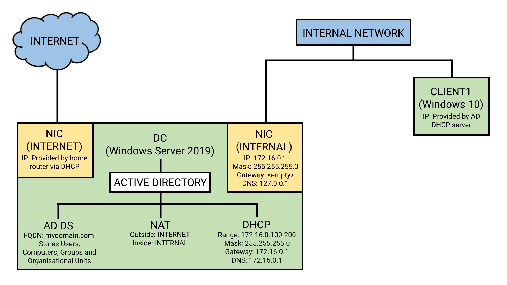

# Administering Windows Accounts in a Private Network using Active Directory

## Introduction

In this project, I set up a basic home lab environment where I configured Active Directory on a domain controller running Windows Server 2019 on a virtual machine using VirtualBox. I then made a Powershell script that added 1000+ users and created 3 organisational units to simulate 3 typical departments a company would have. I then added group policies to each department and added file sharing permissions to implement the principle of least privilige.

Thank you to [**Josh Madakor**](https://www.youtube.com/@JoshMadakor) for creating a guide that I used to setup Active Directory. Here is the link to the video: [Active Directory Setup](https://www.youtube.com/watch?v=MHsI8hJmggI)

## Requirements

For this project, you need VirtualBox installed, as well as the ISO files for both Windows 10 and Windows Server 2019. No specific hardware or OS is required, but the lab performs the best on computers with a good amount of memory and CPU (≥ 8GB RAM and ≥ 8 core processor).

## Design

Here is a diagram showing how the network has been setup:

The virtual machine running Windows Server is the domain controller (DC) for the Active Directory environment. The virtual machine has two network interfaces: one connecting to the internet, and one that is the default gateway of the internal network.

The DC has defined the domain 'mydomain.com' for the Active Directory environment, so that every user, computer, group, shared file and organisational unit can be referenced via the domain within the network.

The Network Address Translation (NAT) service allows each client computer in the internal network connect to the internet through the domain controller.

The Dynamic Host Configuration Protocol (DHCP) server leases IP addresses to the client computers from the range 176.16.0.100 - 176.16.0.200. It also makes the domain controller's internal network interface the default gateway and the primary DNS server for each client computer.

## Sections

> NOTE - Files created in this project can be found in the directory of the section they have been created in

### [Setting up Virtual Machines](./contents/virtual_machine_setup/)

Setting up virtual machines for Active Directory lab

### [Setting up Active Directory Domain Services](./contents/active_directory_setup/)

Setting up Active Directory Domain Services on the DC virtual machine, which includes the DNS, NAT, and DHCP services

### [Active Directory Scripting](./contents/active_directory_scripts/)

Automating the creation of users and organisational units in Active Directory using a Python script and a Powershell Script

### [Setting Up Client Computer](./contents/client_setup/)

Setting up a client Windows 10 virtual machine and connecting it to the Active Directory domain