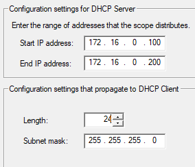

# Setting up Active Directory Domain Services

### Table of Contents

[Setting up Network Interfaces](#setting-up-network-interfaces)

[Installing Active Directory](#installing-active-directory)

[Adding New Administrator User](#adding-new-administrator-user)

[Setting up NAT for Internet Access](#setting-up-nat-for-internet-access)

[Setting up DHCP server](#setting-up-dhcp-server)

[Sections](#sections)

## Setting up Network Interfaces

Before installing Active Directory onto the DC, the networks need to be configured, as well as the hostname for the DC.

To see the network adapter settings, click the network icon on the right of the taskbar.

Then select 'Network & Internet Settings'. Then select the 'Ethernet' tab and select 'Change adapter options' on the right hand side of the window. You will now see the two network interfaces defined when creating the virtual machine.

Since both have the same name, you must first differentiate the NAT interface from the internal network interface. One way to know is that the NAT interface will be connected to the internet, and say 'Network', whereas the internal network will say 'Unidentified network'. To confirm this, right click each interface and select Status > Details.

For the NAT network, the IPv4 address will be '10.0.x.x' address and will have an IPv4 Default Gateway. For the internal network, the IPv4 address will be '169.254.x.x' and will not have a default gateway.

After differentiating the NAT interface from the internal network interface, rename them by right clicking, then selecting 'Rename'. Change the NAT interface to 'O_Internet_O' and change the internal network interface to 'X_Internal_X'.

Then change the settings for the internal network interface. Right click it and select 'Properties'. Then click 'Internet Protocol Version 4 (TCP/IPv4)'.

Select the 'Use the following IP address' option and enter the IP address, subnet mask and DNS server from [the diagram](../../README.md/#design) outlined in the project design.

Then click OK > OK and close the Control Panel and Settings window.

To change the computer's hostname, right click the Start button and select 'System'. Then click 'Rename this PC'.

Change the name to 'DC' and click 'Next', then click 'Restart Now > Continue' to restart the DC computer.

Now your DC VM will have the hostname 'DC'.

## Installing Active Directory

To install Active Directory Domain Services to the DC, go to the server manager application, which by default will display its dashboard.

Click on 'Add roles and features' to add Active Directory. Click 'Next > Next'. For the server selection, you should see the DC server with the configured IP addresses.

Click Next. Then select the 'Active Directory Domain Services' checkbox. Then click 'Add Features' in the popup. Then click 'Next > Next > Next > Install' to install Active Directory Domain Services.

Once the blue bar fills up, the installation is complete. Click 'Close', and then click the flag with the warning symbol on the top right of the Server Manager dashboard.

Click 'Promote this server to a domain controller' to make the virtual machine the DC for your Active Directory lab.

Under 'Deployment Configuration' select the 'Add a new forest' option and enter 'mydomain.com' as the root domain name of the Active Directory network. Then click 'Next'.

Then enter a password in the DSRM field. Then click 'Next'.

Click 'Next > Next > Next > Next > Next > Install'. When the installation is complete, a popup will appear. Click 'Close' and then click 'Close' in the installation window to automatically restart the VM.

Now when you log in, the administrator account will have 'MYDOMAIN\' prepended to it.

## Adding New Administrator User

In system administration, it is good practice to create users with administration privileges to perform administration tasks, rather than using the default administrator account.

To do this, go to the Start Menu > Windows Administrative Tools > Active Directory Users and Computers.

Alternatively, on the Server Manager dashboard, click 'Tools' in the top right of the window, and select 'Active Directory Users and Computers'.

Expand the 'mydomain.com' directory on the left of the window.

Then right click 'mydomain.com' and select New > Organisational Unit. An organisational unit (OU) is a directory for storing different objects in Active Directory, such as users, computers, and groups.

Name this OU '\_Admins'. Prepending underscores to OUs makes it easier to identify custom OUs in large quantities.

> NOTE - If you want to experiment with OUs, uncheck 'Protect container from accidental deletion' to allow the deletion of the OU without extra steps.

Click 'OK' to create the admin OU. Then right click the newly created OU and select New > User. Enter a first name and a surname, then for the user logon name, name it 'a-' followed by the initial of the first name and the full surname e.g. for John Doe: 'a-jdoe'. Then click 'Next'.

Enter a password for the user, and for this lab, uncheck 'User must change password on next logon' and check 'Password never expires'.

> NOTE - In the real world, keep 'User must change password on next logon' checked and 'Password never expires' unchecked for extra security.

Click 'Next > Finish' to create the user.

Then to give the user administrator privileges, right click the user, and select 'Properties'. Then go to the 'Member Of' tab and click 'Add'.

Search 'domain admins' and click 'Check Names' to resolve the search. Then click 'OK'.

Then click 'Apply' and then 'OK' in the properties window to confirm the change. Now the user has been added to the domain admins group and has administrator privileges.

Then sign out and login as the newly created admin user. To do this, on the login screen, click 'Other User' on the bottom left of the screen.

Enter the logon name of the admin user and their password, and press 'Enter'.

You will now login as the admin user.

## Setting up NAT for Internet Access

Remote Access is a service in Active Directory, which has Network Access Translation (NAT) capabilities. NAT allows the client computers to access the internet by using the domain controller's public IP address, which is provided by the domain controller's NAT network adapter in VirtualBox.

> NOTE - This setup is not suitable in a production environment. The best setup for internet access is to make the router the default gateway for both the DC and client computers, and set the DC as the DNS server for the client computers.

To download Remote Access, go to Server Manager and click 'Add roles and features'. On the window, click 'Next > Next > Next'. Select 'Remote Access' and click 'Next > Next > Next'.

For the Remote Access roles, select 'Routing'.

On the popup, click 'Add Features', then click 'Next > Next > Next > Install'.

Once the installation is complete, click 'Close' and go to 'Tools' on the top right of the Server Manager and click 'Routing and Remote Access'.

In the new window, right click 'DC (local)', and select 'Configure and Enable Routing and Remote Access'. In the setup wizard, click 'Next' and select the 'NAT' radio button. Then click 'Next'.

Then from the two network interfaces that show up, select the internet one, which in this lab is named 'O_Internet_O'.

> NOTE - If the interfaces do not show up, close the setup wizard and Routing and Remote Access, and reopen them.

Click 'Next > Finish', and the NAT will begin to setup.

> NOTE - If you get the following warning after clicking 'Finish', press OK and the NAT will setup anyway.
>
> 

> 
> 

Once the NAT has been setup, the 'DC (local)' text in the Routing and Remote Access window has changed from a circle with a red arrow to a circle with a green arrow. This means the NAT has been setup successfully.

## Setting up DHCP server

Active Directory has a DHCP server feature, which automatically leases IP addresses to client devices connected to the internal network, giving them the ability to communicate with each other and the internet.

To install the DHCP service, go to Server Manager, and select 'Add roles and features' and click 'Next > Next > Next'. Now select 'DHCP Server' and click 'Add Features' in the popup window.

Then click 'Next > Next > Next > Install' to install the DHCP service. Once the installation is complete, click 'Close'. Then on Server Manager, go to 'Tools > DHCP'.

On the left, click the arrow next to  your domain controller's domain name (dc.mydomain.com), right click 'IPv4' and select 'New Scope'.

Click 'Next', then give the scope the name '172.16.0.100-200' and click 'Next'.

Add the '172.16.0.100' as the start IP address, '172.16.0.200' as the end IP address, and 24 for the length, which will automatically make the subnet mask '255.255.255.0'.

Click 'Next > Next'. For the lease duration, it is set as 8 days by default, which is a sensible value. This should be decreased if this was a DHCP server for a public WiFi network. Click 'Next'.

Make sure that 'Yes' is selected in the configure DHCP options page and click 'Next'.

For the default gateway, type '172.16.0.1', which is the IP address of the DC. Then click 'Add' and select the IP address. Then click 'Next'.

For the DNS server, select the IP address of the DC and then click 'Next'.

Click 'Next > Next > Finish' to complete the DHCP scope setup. On the DHCP window, right click the DC domain name and click 'Authorize'.

Then right click the DC domain name again and click 'Refresh'. Now the IPv4 and IPv6 text will have green tick icons. This means DHCP has been setup successfully.

## Sections

#### Home Page: [Active Directory](../../)

#### Previous Section: [Setting up Virtual Machines](../virtual_machine_setup/)

#### Next Section: [Active Directory Scripting](../active_directory_scripts/)
