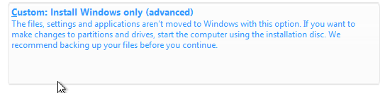
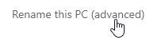
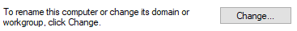
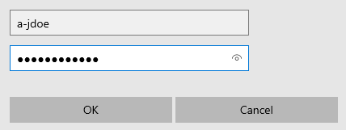

# Setting Up Client Computer

### Table of Contents

[Setting Up Client Computer Virtual Machine](#setting-up-client-computer-virtual-machine)

[Adding Client Machine to Active Directory](#adding-client-machine-to-active-directory)

[Sections](#sections)

## Setting Up Client Computer Virtual Machine

Now that the computer objects are added to AD, the next step is to connect a Windows 10 client computer to the AD computer object. To test the functionality of group policies, we will be creating 3 different client virtual machines. However, all that needs to be done is to setup one machine, and then duplicate it twice.

> NOTE - For this section, make sure the DC is running so that the client computer can connect to Active Directory

Go to VirtualBox and create a new virtual machine by clicking the 'New' button:

<p align="center">

</p>

Name your virtual machine 'AD-FN-CLIENT1' (Active Directory Domain Controller). This will be the computer for the Finance department.

Select the Windows 10 ISO file for the 'ISO Image' option, and check 'Skip Unattended Installation'. Then click 'Next'.

<p align="center">

</p>

For the memory, you can keep it as the default settings, but if you have more resources to use, you can adjust the memory and number of processors in this step and in the future. Click 'Next' when you're happy with the memory.

<p align="center">

</p>

For the virtual hard disk, change it from 50GB to 20GB, as this lab doesn't require a large amount of storage. Then click 'Next'.

<p align="center">

</p>

Click 'Finish' on the summary page to create your virtual machine. Then right click your newly created virtual machine and click 'Settings':

<p align="center">

</p>

Under 'General', click 'Advanced' and change 'Shared Clipboard' and 'Drag'n'Drop' to 'Bidirectonal'. This is to enable clipboard and file sharing between your PC and your virtual machine.

<p align="center">

</p>

Under 'Network', make sure Adapter 1 is attached to 'Internal Network', and choose 'ad-intnet' used by the domain controller. This will connect client VM to the DC's network, allowing it to be used as a AD client computer.

<p align="center">

</p>

Click 'OK'. Your virtual machine is now setup. To start it, click the 'Start' icon or double click the virtual machine.

After some time, the virtual machine will display a setup screen. For the first settings, choose the language, time format, and keyboard settings for you. Then click 'Next'.

<p align="center">

</p>

Then click 'Install Now'.

After some time, you will be asked to enter a product key. Click 'I don't have a product key'.

<p align="center">

</p>

Then select 'Windows 10 Pro' for the operating system and click 'Next'.

<p align="center">

</p>

Check the box to accept the license terms and click 'Next'. Then select the 'Custom' installation type.

<p align="center">

</p>

Click 'Next' and Windows 10 will begin installing.

After some time, the virtual machine will restart automatically and load some more. Eventually, you will be greeted with a screen with options.

> IMPORTANT - This part of the Windows 10 setup includes steps that will differ from instance to instance. This means the steps I outline will differ to the steps you take. The main point though is to make a local user account, which connects to the internal network without unnecessary tracking and ads, so if you set up the client with this in mind, the outcome will be the same.

For the region, make sure your region is selected, and click 'Yes'.

<p align="center">

</p>

For the keyboard layout, make sure your layout is selected, and click 'Yes'.

<p align="center">

</p>

Click 'Skip' for the second keyboard layout. After some time, you will be asked how you would like to setup your Windows 10 computer. Select 'Set up for personal use' and click 'Next'.

<p align="center">

</p>

Click 'Offline Account' on the bottom right when prompted to add your Microsoft account.

<p align="center">

</p>

Select 'Limited experience' on the bottom right when prompted to sign into Microsoft account.

<p align="center">

</p>

Then for the local user's username, make it 'user' and click 'Next'. Leave the password black and click 'Next'.

> NOTE - The user and password will not be used as this will be a computer controlled by Active Directory. However, in a production environment, use a stronger username and password.

For the browser import prompt, click 'Not now'.

<p align="center">

</p>

For the location, ads, and diagnostic data settings, choose either the 'No', 'Limited', or 'Required only' options.

Skip the experience customisation options. Click 'Not now' for Cortana.

Now the account will setup.

<p align="center">

</p>

After some time, Windows 10 will finally finish setting up, and you will be faced with the main desktop.

<p align="center">

</p>

The next step is to check if the client machine is connected to the AD internal network, and has internet connectivity. Firstly, go to the command prompt by pressing 'START + R', typing in 'cmd' and pressing 'Enter'.


<p align="center">

</p>

Then get the network interface information of the machine:

```cmd
ipconfig
```

The output should look something like this:

<p align="center">

</p>

The IPv4 address should be in the ranges specified in the AD DHCP server (172.16.1.100-200), and the default gateway should be the IP address of the DC (172.16.0.1).

To test the internet connectivity, we will send ICMP ping requests to Google.

```cmd
ping www.google.com
```

If the pings are successfully returned to the machine, then the client machine has internet connectivity.

<p align="center">

</p>

Before adding the PC to Active Directory, add VirtualBox to improve the display. Click Devices > Insert Guest Additions CD image in the toolbar on the top left of the virtual machine window.

<p align="center">

</p>

Then inside the VM, open File Explorer and go to This PC > CD Drive (D:) VirtualBox Guest Additions. Then click the Windows executable ending in 'amd64' to open the Guest Additions installer:

<p align="center">

</p>

Click Next > Next > Install to install Guest Additions. After it installs, select the 'I want to manually reboot later' option and click Finish.

<p align="center">

</p>

Then manually shut down the computer and reopen it for Guest Additions to take effect.

Before moving onto the next step, take a snapshot of the client VM's current state, as this will be used as a base template for the other client VMs.

To do this, make sure the client VM is shut down, then in VirtualBox, click the slider icon on the right of the virtual machine, and click 'Snapshots'.

<p align="center">

</p>

Then click the 'Take' icon to take a snapshot. Give the snapshot the name 'AD-CLIENT Base State' and click 'OK' to create the snapshot.

<p align="center">

</p>

Now that the base snapshot has been taken, clone the snapshot by clicking on the snapshot, and clicking the 'Clone' icon.

<p align="center">

</p>

Change the name to 'AD-HR-CLIENT1', and make sure that the MAC address policy is not 'Include all network adapter MAC addresses'. This will result in the two client machines having the same MAC address and as a result, using the same IP address in AD. Then click 'Next'.

<p align="center">

</p>

Make sure that 'Full clone' is selected and then click 'Next'. Then make sure 'Current machine state' is selected and the click 'Finish'. After some time, you will now have a clone of the first client machine.

Repeat the cloning process again, but this time create a clone named 'AD-IT-CLIENT1' for the IT department client computer.

<p align="center">

</p>

## Adding Client Machine to Active Directory

Now that the machine has been setup successfully, it needs to be connected to Active Directory.

To do this, right click the Windows icon and select 'System'.

<p align="center">
 System" height="500px">
</p>

Scroll down and click 'Rename this PC (advanced)'. If it's not at the bottom of the page, then it should be on the right of the page.

<p align="center">

</p>

Then click 'Change'.

<p align="center">

</p>

Name the PC the same name as the computer object within Active Directory. In this case 'FN-CLIENT1'. Click the 'Domain' radio button and type 'mydomain.com' into the domain name. Then click 'OK'.

<p align="center">

</p>

A popup will appear asking you to enter the account details of an account in the AD domain. Use the custom administrator account's username and password and click 'OK'.

<p align="center">

</p>

If successful, you will be given a popup welcoming your PC to 'mydomain.com'. Click 'OK > OK' and then close the PC name settings to get the restart prompt. Select 'Restart Now' to restart your computer.

<p align="center">

</p>

After resetting the computer, click 'Other User' on the bottom right of the login screen.

<p align="center">

</p>

You will now see that you can login as a user from 'MYDOMAIN'. For this example, we will use the first Finance user, which is 'aabrev'. Enter the login credentials for 'aabrev' and press Enter to login.

<p align="center">

</p>

After logging in, wait for a minute and after the account has been set up, the AD user will be successfully logged in through the client PC.

Repeat the process of renaming the PC for the other two client machines. Make sure to rename the PC to 'HR-CLIENT1' for the HR VM, and 'IT-CLIENT1' for the IT VM.

To see the changes, go to the DC and go to the DHCP tool. If you go to the address leases in you defined scope, you will see the client PCs.

<p align="center">

</p>

Also, if you go to 'Active Directory Users and Computers' and click the properties of the client PC connected to AD, it will show you the operating system of the client PC in its properties.

<p align="center">

</p>

## Sections

#### Home Page: [Active Directory](../../)

#### Previous Section: [Active Directory Scripting](../active_directory_scripts/)

#### Next Section: [](.)
