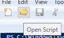
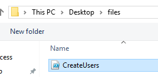

# Creating Users using Powershell Script

### Table of Contents

[Installing Python](#installing-python)

[Sections](#sections)

## Installing Python

Now that Active Directory has been setup, it is time to simulate a real-world example of Active Directory in use to manage a company's users and computers. Creating objects in Active Directory can be automated through the use of Powershell scripts, with the use of the Active Directory API.

I have written two scripts: one in Python, and one in Powershell. The Python script is responsible for reformatting the names text file to ensure that no empty lines are added as AD users, and that there are no duplicate usernames from clashing first name initials and surname combinations. The Powershell script creates organisational units for each department in the departments text file, and then creates users using the formatted names text file and adds them to one of the three departments using a loop.

Drag and drop the 'files' folder in the directory of this README file into the virtual machine. If you enabled 'Drag'n'Drop', the files should copy into the desktop.

<p align="center">

</p>

By default, Python is not installed on Windows Server, so you will have to install it to run the Python script. To do this, go to the start menu, click the 'Windows Powershell' folder, and right click 'Windows Powershell'. Select 'More > Run as administrator' to open Powershell.

<p align="center">

</p>

Click 'Yes' on the administrator prompt. In Powershell, go to the Downloads folder of the current administrator user:

```powershell
cd $env:USERPROFILE\Downloads\
```

Get the installation executable:

```powershell
Invoke-WebRequest -Uri "https://www.python.org/ftp/python/3.11.5/python-3.11.5-amd64.exe" -OutFile "python-3.11.5-amd64.exe"
```

Then install Python:

```powershell
.\python-3.11.5-amd64.exe /quiet InstallAllUsers=1 PrependPath=1 Include_test=0
```

Reload the environment variables to make sure Python is accessible via the command line:

```powershell
$env:Path = [System.Environment]::GetEnvironmentVariable("Path","Machine") + ";" + [System.Environment]::GetEnvironmentVariable("Path","User")
```

To check if Python has successfully installed, type:

```powershell
python -V
```

Powershell will return 'Python 3.11.5' if Python has installed successfully.

Now that Python has installed, exit Powershell, then go 'Start Menu > Windows Powershell' and right click 'Windows Powershell ISE'.

<p align="center">

</p>

Select 'More > Run as administrator' and click 'Yes' on the administrator prompt to start Powershell ISE.

In Powershell ISE, click the 'Open Script' icon in the top toolbar of the window.

<p align="center">

</p>

Then select the 'CreateUsers.ps1' file in the 'files' folder copied onto the Desktop.

<p align="center">

</p>

Before running the Powershell script, the Python Script must be ran first. To do this, in the command line at the bottom half of Powershell ISE, change the directory:

```powershell
cd $env:USERPROFILE\Desktop\files\
```

<p align="center">

</p>

Then set the execution policy to allow scripts to be ran:

```powershell
Set-ExecutionPolicy Unrestricted
```

Click 'Yes to All' in the popup window.

Then run the Python script:

```powershell
python .\format_names.py
```

After the script is complete, it is time to run the Powershell script. Before running it, inspect the script, and comment the 2nd line and uncomment the 4th line if you would like to hard code the password for all users.

Otherwise, run the Powershell script by pressing the 'Run Script' icon in the toolbar.

<p align="center">

</p>

Enter the password that you want to give the accounts in this lab if prompted, and now the script will automatically create the organisational units and users in AD.

## Sections

#### Home Page: [Active Directory](../../)

#### Previous Section: [Setting up Active Directory Domain Services](../active_directory_setup/)

#### Next Section: [](.)
