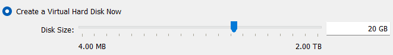
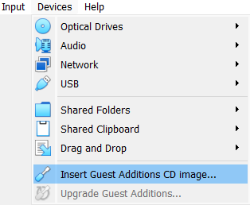
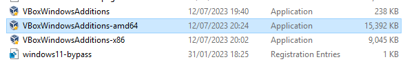

# Setting up Virtual Machines

### Table of Contents

[Downloading Dependencies](#downloading-dependencies)

[Setting up Windows Server](#setting-up-windows-server)

[Setting Up VirtualBox Guest Additions](#setting-up-virtualbox-guest-additions)

[Sections](#sections)

## Downloading Dependencies

For this lab, you need VirtualBox (or any other virtualisation software) and ISO files for both Windows Server 2019 and Windows 10. Here are the links to the downloads:

[Oracle VM VirtualBox](https://www.virtualbox.org/wiki/Downloads)

[Windows Server 2019](https://www.microsoft.com/en-us/evalcenter/download-windows-server-2019)

[Windows 10](https://www.microsoft.com/en-us/software-download/windows10)

### VirtualBox

For VirtualBox, click on the host for your PC:

After the installer downloads, install VirtualBox.

### Windows Server 2019

For Windows Server, make sure to select the ISO downloads option. After that, the ISO will begin downloading from your browser:

### Windows 10

For Windows 10, click 'Download Now' under 'Create Windows 10 installation media'. After that, the installation media will begin downloading from your browser:

Open the 'MediaCreationTool' executable and run it. Then follow the following steps:

- Accept the licensing terms
- Select the 'Create installation media' option and click 'Next'
- Make sure that the Windows version is 10 and the architecture is 64-bit, then click 'Next'
- Select 'ISO file' and click 'Next'
- Save the ISO in a folder for your virtual machines and click 'Save'

Then the ISO file will begin to download. Once it finishes, click 'Finish'.

## Setting up Windows Server

In VirtualBox, create a new virtual machine by clicking the 'New' button:

Name your virtual machine 'AD-DC' (Active Directory Domain Controller):

For the ISO image, select the ISO file for Windows Server. Click 'Other' if your ISO file doesn't show up, then select it from your file explorer.

Check the 'Skip Unattended Installation' box and click 'Next':

For the memory, you can keep it as the default settings, but if you have more resources to use, you can adjust the memory and number of processors in this step and in the future. Click 'Next' when you're happy with the memory.

For the virtual hard disk, change it from 50GB to 20GB, as this lab doesn't require a large amount of storage. Then click 'Next'.

Click 'Finish' on the summary page to create your virtual machine. Then right click your newly created virtual machine and click 'Settings':

Under 'General', click 'Advanced' and change 'Shared Clipboard' and 'Drag'n'Drop' to 'Bidirectonal'. This is to enable clipboard and file sharing between your PC and your virtual machine.

Under 'Network', make sure Adapter 1 is attached to 'NAT'. This will connect your virtual machine to your router, but won't be accessible by other devices on your network.

Click 'Adapter 2', enable the network adapter and change the attached adapter to 'Internal Network'. Name your internal network 'ad-intnet' to isolate your lab environment from other VirtualBox internal networks.

Click 'OK'. Your virtual machine is now setup. To start it, click the 'Start' icon or double click the virtual machine.

After some time, the virtual machine will display a setup screen. For the first settings, choose the language, time format, and keyboard settings for you. Then click 'Next'.

Then click 'Install Now'.

After some time, select 'Windows Server 2019 Standard Evaluation (Desktop Experience)' and click 'Next'.

Accept the licensing terms and click 'Next', then click the 'Custom' Windows installation type:

On the next page, the virtual hard disk will already be selected, so click 'Next'. Now Windows Server will install on the virtual machine.

After waiting for some time, the virtual machine will automatically restart. Once the virtual machine has rebooted, you will be prompted to create a password for the administrator account. Enter your password and click 'Finish'.

After some time. You will be directed to the Windows login page. Press the right CTRL button and Delete to input a 'CTRL+ALT+DEL' into the machine to login, enter your password for the administrator account and press Enter.

You will now be logged into the Windows Server machine. Click 'Yes' on the Networks popup to ensure that the DC is discoverable by other devices on it's network.

## Setting Up VirtualBox Guest Additions
In VirtualBox VMs, you can improve their performance and their appearance by using the VirtualBox Guest Additions image. To set this up in the DC, click Devices > Insert Guest Additions CD image in the toolbar on the top left of the virtual machine window.

Then inside the VM, open File Explorer and go to This PC > CD Drive (D:) VirtualBox Guest Additions. Then click the Windows executable ending in 'amd64' to open the Guest Additions installer:

Click Next > Next > Install to install Guest Additions. After it installs, select the 'I want to manually reboot later' option and click Finish.

Then manually shut down the computer. After clicking shut down, click 'Continue' for the reason for shutdown dropdown.

Start the VM again and login as the administrator account. After about 20 seconds, the virtual machine will stretch out to the entirety of the VirtualBox window. If it doesn't happen straight away, try changing the size of the window and it will eventually start to change the resolution of the VM.

## Sections

#### Home Page: [Active Directory](../../)

#### Next Section: [Setting up Active Directory Domain Services](../active_directory_setup/)
