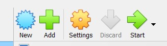

# Setting up Virtual Machines

### Table of Contents

[Downloading Dependencies](#downloading-dependencies)

[Setting up Windows Server](#setting-up-windows-server)

[Sections](#sections)

## Downloading Dependencies

For this lab, you need VirtualBox (or any other virtualisation software) and ISO files for both Windows Server 2019 and Windows 10. Here are the links to the downloads:

[Oracle VM VirtualBox](https://www.virtualbox.org/wiki/Downloads)

[Windows Server 2019](https://www.microsoft.com/en-us/evalcenter/download-windows-server-2019)

[Windows 10](https://www.microsoft.com/en-us/software-download/windows10)

### VirtualBox

For VirtualBox, click on the host for your PC:

After the installer downloads, install VirtualBox.

### Windows Server 2019

For Windows Server, make sure to select the ISO downloads option. After that, the ISO will begin downloading from your browser:

### Windows 10

For Windows 10, click 'Download Now' under 'Create Windows 10 installation media'. After that, the installation media will begin downloading from your browser:

Open the 'MediaCreationTool' executable and run it. Then follow the following steps:

- Accept the licensing terms
- Select the 'Create installation media' option and click 'Next'
- Make sure that the Windows version is 10 and the architecture is 64-bit, then click 'Next'
- Select 'ISO file' and click 'Next'
- Save the ISO in a folder for your virtual machines and click 'Save'

Then the ISO file will begin to download. Once it finishes, click 'Finish'.

## Setting up Windows Server
In VirtualBox, create a new virtual machine by clicking the 'New' button:

Name your virtual machine 'AD-DC' (Active Directory Domain Controller), and change the folder that you will store your VM, if you want to.

Then for the ISO image, select the ISO file for Windows Server:

Click 'Other' if your ISO file doesn't show up, then select it from your file explorer.

## Sections

#### Home Page: [Active Directory](../../)

#### Next Section: [...](.)
